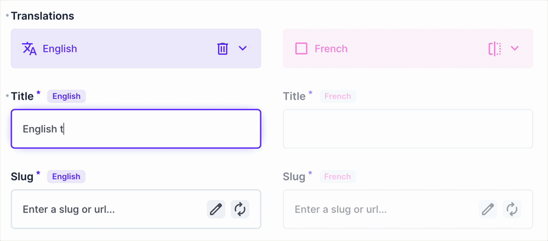

This project is a fork of the original [directus-slug-generator](https://github.com/markosiilak/directus-slug-generator).  The fork is actively maintained and includes additional features, bug fixes, and improvements that are not available in the original project for now.

Improvements in relation to previous version:

* Correct source field determining (works correctly with Translations interface with split mode enabled)
* UI improvements: slug field looks like a regular Directus field

## Demo



## Directus Slug Generator (Improved) Extension

A powerful Directus extension that automatically generates URL-friendly slugs from other fields in your collection. Perfect for creating SEO-friendly URLs, blog posts, articles, and any content that needs clean, readable URLs.

## 🚀 Quick Start

### NPM Installation (Recommended)

```bash
npm install directus-slug-generator
```

### Manual Installation

1. Copy the extension to your Directus extensions directory
2. Install dependencies: `npm install`
3. Build the extension: `npm run build`
4. Restart Directus
5. Configure the interface in your collection fields

## 📦 Installation Methods

### Method 1: NPM Package (Recommended)

```bash
# Install the latest version
npm install directus-slug-generator
```

### Method 2: Directus Extensions Directory

```bash
# Clone or download the extension
git clone https://github.com/markosiilak/directus-slug-generator.git
cd directus-slug-generator

# Install dependencies
npm install

# Build the extension
npm run build

# Copy to your Directus extensions directory
cp -r . /path/to/your/directus/extensions/interfaces/slug-generator/
```

### Method 3: GitHub Release

1. Download the latest release from [GitHub Releases](https://github.com/markosiilak/directus-slug-generator/releases)
2. Extract to your Directus extensions directory
3. Install dependencies and build

## 🔧 Configuration

### 1. Add to Your Collection

1. Go to your Directus admin panel
2. Navigate to **Settings** → **Data Model**
3. Select your collection (e.g., "Articles")
4. Add a new field (e.g., "slug")
5. Set the interface to **"Slug Generator"**

### 2. Configure the Interface

```json
{
  "selectField": "title",
  "generationMode": "slug",            // "slug" | "uuid"
  "auto": true,                          // Auto-generate on mount/changes
  "required": true,
  "separator": "-",
  "lowercase": true,
  "placeholder": "Enter a slug or url...",
  "customEmptyMessage": null,
  "customFormatMessage": null,
  "customUniqueMessage": null,
  "allowDuplicates": false,             // If false, checks uniqueness in the collection
  "autoUpdateMode": "change",         // "disabled" | "change" | "blur" | "focus" | "realtime"
  "preserveExisting": false,            // Keep existing value when source changes
  "updateDelay": 100,
  "showPreviewLink": true,
  "previewBaseUrl": "https://example.com",
  "previewOpenInNewTab": true
}
```

## ✨ Features

- **🔄 Automatic generation** from any source field
- **🆔 UUID mode**: generate RFC4122 v4 values when desired
- **⚡ Auto-update** with multiple trigger modes
- **💾 Preserve existing** value on source changes
- **🔗 Preview link** rendering with configurable base URL and target
- **📅 Date awareness** when the source is a date-like field
- **🌍 Transliteration** for Cyrillic, German/Nordic, and broader Latin characters
- **✅ Validation** for URL/slug format and optional uniqueness check

## 📋 Usage Examples

### Basic Blog Post Setup

```javascript
// Collection: blog_posts
// Fields: title, slug, content, published_date

{
  "selectField": "title",
  "auto": true,
  "autoUpdateMode": "change",
  "separator": "-",
  "lowercase": true
}

// Input: "My Amazing Blog Post!"
// Output: "my-amazing-blog-post"
```

### UUID mode

```json
{
  "generationMode": "uuid",
  "auto": true,
  "allowDuplicates": true
}
```

### Preview link

```json
{
  "showPreviewLink": true,
  "previewBaseUrl": "https://example.com/blog",
  "previewOpenInNewTab": true
}
```

### Product Catalog

```javascript
// Collection: products
// Fields: name, slug, category, price

{
  "source_field": "name",
  "auto_update": true,
  "update_mode": "change",
  "separator": "-",
  "lowercase": true,
  "preserveExisting": true
}

// Input: "iPhone 15 Pro Max"
// Output: "iphone-15-pro-max"
```

## 🔄 Auto-Update Configuration

### Update Modes


| Mode       | Description                          |
| ---------- | ------------------------------------ |
| `disabled` | No automatic updates                 |
| `change`   | Update on input/change events        |
| `blur`     | Update when source field loses focus |
| `focus`    | Update when source field gains focus |
| `realtime` | Same as`change` (live typing)        |

### Configuration Options

See the JSON block above for all available options and defaults.

## 🌍 Internationalization

Built-in transliteration covers:

- **Cyrillic (Russian)**
- **German/Nordic** (ä→ae, ö→oe, ü→ue, ß→ss, å→a, æ→ae, ø→o)
- **Broad Latin accents** (á, ç, ñ, etc.)

### Custom Transliteration (pre-processing example)

```javascript
{
  "transliteration": {
    "custom_rules": {
      "&": "and",
      "©": "copyright",
      "®": "registered"
    }
  }
}
```

## ✅ Validation

- **Format**: Accepts full URLs (http/https) or slugs. For URLs, dots/colons/slashes are preserved and cleaned. For slugs, letters, numbers, hyphens and slashes are allowed and normalized.
- **Uniqueness**: If `allowDuplicates` is false, the value is checked for uniqueness in the current collection (excluding the current item by primary key).
- **Draft bypass**: If your item status is `draft`, validation is skipped until publishing.

## 🛠️ Development

### Local Development

```bash
# Clone the repository
git clone https://github.com/markosiilak/directus-slug-generator.git
cd directus-slug-generator

# Install dependencies
npm install

# Build for development
npm run build

# Watch for changes
npm run dev

# Run tests
npm test
```

### Building for Production

```bash
# Build optimized version
npm run build

# Build with source maps
npm run build:dev
```

## 📚 API Reference

### Emits


| Event        | Payload                      |
| ------------ | ---------------------------- |
| `input`      | `string` (the current value) |
| `validation` | `boolean` (is valid)         |

## 🙏 Acknowledgments

- Built for [Directus](https://directus.io/)
- Inspired by modern URL practices
- Thanks to the Directus community for feedback and contributions

---

**Made with ❤️ by [Marko Siilak](https://github.com/markosiilak)**
